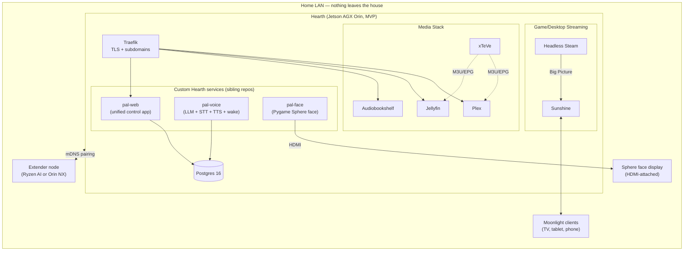

# HearthOS

[](https://github.com/A-Hackers-Guide/palpod-os/actions/workflows/ci.yml)
[](https://github.com/A-Hackers-Guide/palpod-os/actions/workflows/lint.yml)
[](https://codecov.io/gh/A-Hackers-Guide/palpod-os)
[](LICENSE)
[](https://www.python.org/downloads/)
[](https://www.kicad.org/)
[](https://github.com/A-Hackers-Guide/palpod-os/graphs/contributors)

> The software layer of Hearth — a $95k fully-offline luxury home AI and media
> server. This repository provides the orchestration scaffolding: everything a
> single Jetson AGX Orin dev kit needs to boot into a working Pod after one
> `install.sh`.

---

## What this is

HearthOS is the **base platform**. It brings up:

- Media services (Plex, Jellyfin, Audiobookshelf)
- Live-TV proxy (xTeVe → M3U/EPG into Plex & Jellyfin as first-class channels)
- Game & desktop streaming (Sunshine, GPU-accelerated, Moonlight-compatible)
- Headless Steam (Steam Big Picture streamed to any Moonlight client — never to
  the Sphere face)
- Remote Desktop — RustDesk self-hosted (rendezvous + relay) so the Pod can
  view and drive your other machines with your permission; AnyDesk is
  available as an opt-in `--profile anydesk` alternative
- A Postgres 16 database for the `pal-web` control app
- A reverse proxy (Traefik) with LAN-local TLS on `*.palpod.local`
- Reference mount points for the three sibling repos:
  `pal-web`, `pal-voice`, `pal-face`

MVP hardware: **one NVIDIA Jetson AGX Orin 64GB Developer Kit** running
Ubuntu 22.04 aarch64.

Production hardware (future): a cluster of 10× Jetson Orin NX + 10× Ryzen
AI 9 HX 370 nodes on TrueNAS SCALE with 5 TB ECC DDR5 and 35 TB NVMe JBOD.
The compose file here is the **development target**; the production target is
TrueNAS's Kubernetes app catalog (see [`docs/ARCHITECTURE.md`](docs/ARCHITECTURE.md)).

---

## Remote Desktop

The Pod can view and drive your other machines — Macs, PCs, iPhones,
Androids — through a self-hosted RustDesk stack. The rendezvous server
(`hbbs`) handles peer discovery and the relay (`hbbr`) forwards traffic when
a direct LAN path isn't available. Both run on the Pod. **No third-party
server ever touches your streams**, and the X25519 keypair used to
authenticate peers is generated during `install.sh` and never leaves the box.

Typical use:

- *"Hey Hearth, show me the office Mac"* → Pod pulls up a live view of that
  machine on the TV you're near (or any Moonlight extender).
- *"Hey Hearth, click the send button on my laptop"* → Pod drives the mouse and
  keyboard on the remote machine — only for devices you've explicitly
  granted **AI control** to.
- The pal-web UI lists every registered device, opens a session, and shows
  session history from the `remote_sessions` Postgres table.

### Setup flow

1. Install the RustDesk client on the machine you want to reach
   (macOS, Windows, Linux, iOS, Android — all supported by upstream).
2. On the Pod, run `scripts/pair-remote-device.sh` — it prints a one-time
   pairing token and the Pod's rendezvous address.
3. Paste both into the RustDesk client's "ID Server" field. Approve the
   pairing dialog that pops up in pal-web.
4. The device shows up under **Settings → Remote Devices** in pal-web.

### Permission model

- **Default: view-only.** Voice requests like "show me…" work out of the box
  for any paired device.
- **AI control is opt-in per device.** In pal-web, toggle *Allow AI control*
  on the device card. Without this flag the click/type/scroll endpoints
  return 403 even to an authenticated Pod session.
- **Every session is logged.** Start time, end time, initiator (voice / web
  / API), input events for AI-driven sessions, all recorded in
  `remote_sessions`. Revoke a device from the same page — its auth token is
  destroyed and any live session is torn down.

### AnyDesk alternative

Some users prefer AnyDesk's commercial client. The compose file ships an
AnyDesk service behind a `docker compose` profile, disabled by default.
Opt in with:

```bash
docker compose --profile anydesk up -d
```

You'll be prompted to accept the AnyDesk EULA on first launch. RustDesk and
AnyDesk can run side-by-side; pal-web treats them as two backends behind the
same "Remote Devices" list.

---

## Install (Ubuntu 22.04, Jetson AGX Orin)

```bash
git clone https://github.com/palpod/palpod-os.git
cd palpod-os
./install.sh
```

`install.sh` will:

1. Detect the NVIDIA GPU and install the NVIDIA Container Toolkit.
2. Install Docker Engine and the `docker compose` plugin.
3. Copy `.env.example` → `.env` and prompt you for the missing values.
4. Pull every image referenced in `docker-compose.yml`.
5. Run `scripts/first-boot.sh` to create ZFS datasets (if TrueNAS is present)
   or plain directories under `/var/lib/palpod` (Ubuntu default).
6. `docker compose up -d` — and print the URLs to open in your browser.

---

## Architecture



## Service ports

| Service          | Container         | LAN URL (via Traefik)              | Direct port  | Notes                             |
|------------------|-------------------|------------------------------------|--------------|-----------------------------------|
| Plex             | `plex`            | `https://plex.palpod.local`        | `32400`      | Owner claim token needed on init  |
| Jellyfin         | `jellyfin`        | `https://jelly.palpod.local`       | `8096`       | HW transcode via `/dev/nvhost*`   |
| Audiobookshelf   | `audiobookshelf`  | `https://books.palpod.local`       | `13378`      |                                   |
| xTeVe            | `xteve`           | `https://xteve.palpod.local`       | `34400`      | Feeds Plex & Jellyfin             |
| Sunshine         | `sunshine`        | `https://sunshine.palpod.local`    | `47990`      | Web UI. Stream on 47984–48010     |
| Steam (headless) | `steam-headless`  | (via Sunshine)                     | n/a          | Never routed to Sphere            |
| Postgres 16      | `postgres`        | (internal only)                    | `5432`       | Backing store for `pal-web`       |
| Traefik          | `traefik`         | `https://traefik.palpod.local`     | `80/443`     | Dashboard on `:8080` (internal)   |
| pal-web          | `pal-web`         | `https://pod.palpod.local`         | `3000`       | Sibling repo, code-mounted        |
| pal-voice        | `pal-voice`       | (internal gRPC)                    | `50051`      | Sibling repo, code-mounted        |
| pal-face         | `pal-face`        | (HDMI output, no port)             | n/a          | Sibling repo, code-mounted        |
| RustDesk hbbs    | `rustdesk-hbbs`   | (LAN-direct)                       | `21115-21116`| Rendezvous / ID server            |
| RustDesk hbbr    | `rustdesk-hbbr`   | (LAN-direct)                       | `21117`      | Relay server (fallback path)      |
| AnyDesk (opt-in) | `anydesk`         | (LAN-direct)                       | n/a          | Off by default; `--profile anydesk` |

---

## Known limitations (MVP)

This scaffolding is intentionally opinionated toward the **single-Jetson developer
kit**. In particular:

- **No Kubernetes.** Production Pods run on TrueNAS SCALE and are deployed via
  its Kubernetes app catalog. Porting each service is straightforward but out of
  scope here. See [`docs/ARCHITECTURE.md`](docs/ARCHITECTURE.md) §Production.
- **No ZFS by default.** On Ubuntu, everything lives under `/var/lib/palpod/`.
  If ZFS is detected, the first-boot script will offer to create datasets.
- **No hardware failover.** The compose stack is single-node. Extender pairing
  is defined (see [`docs/EXTENDER_PAIRING.md`](docs/EXTENDER_PAIRING.md)) but
  role reassignment on primary loss is a v1.1 feature.
- **Sunshine + Steam are Linux-native.** On the Jetson (aarch64) Steam runs
  under Proton via Box64 emulation and only a subset of the library is playable.
  Real production nodes use the Ryzen AI x86 servers for gaming.
- **TLS on `*.palpod.local` is a self-signed root** installed on the LAN.
  Public certs are out of scope — nothing here should touch the public internet.

---

## Repo layout

```
palpod-os/
├── docker-compose.yml       # THE compose file
├── install.sh / update.sh / uninstall.sh
├── configs/                 # Per-service config (traefik, xteve, sunshine, …)
├── systemd/                 # Boot units
├── scripts/                 # first-boot, extender-pair, media-import
└── docs/                    # Architecture, install, extender protocol, security, backup
```

## Sibling repos (built in parallel by the other teams)

- `pal-web`   — Next.js unified control app; mounted at `../pal-web`
- `pal-voice` — LLM + Whisper STT + Piper TTS + openWakeWord; mounted at `../pal-voice`
- `pal-face`  — Pygame Sphere face renderer; mounted at `../pal-face`

Update these paths in `.env` if your checkout layout differs.

---

## License

Apache 2.0 — see [LICENSE](LICENSE).
