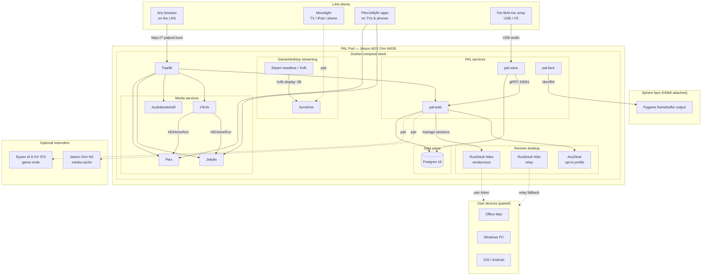
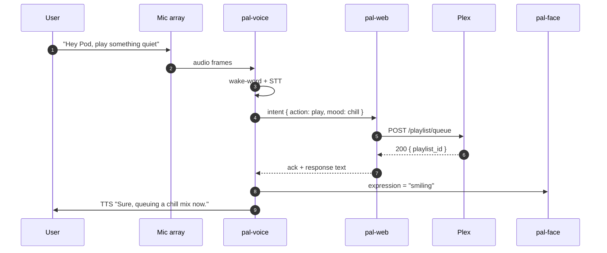

# PALPod OS — Architecture

This document describes how the pieces of PAL Pod fit together on the MVP
single-Jetson deployment and how the same design scales to the production
10-node cluster on TrueNAS SCALE.

---

## 1. System topology (MVP)



---

## 2. Service responsibilities

| Service            | Role                                                                                     | Owns                                                    | Depends on                                            |
|--------------------|------------------------------------------------------------------------------------------|---------------------------------------------------------|-------------------------------------------------------|
| **Traefik**        | TLS termination + subdomain routing                                                      | `*.palpod.local` certs                                  | Docker socket, TLS root                               |
| **Postgres 16**    | Durable state for `pal-web`                                                              | `users`, `profiles`, `extender_registry`, `upload_events`, `memory_facts` | own data volume                              |
| **Plex**           | Family-facing media                                                                      | Plex config volume                                      | `MEDIA_*` bind mounts                                 |
| **Jellyfin**       | Open-source second-opinion media                                                         | Jellyfin config volume                                  | `MEDIA_*` bind mounts                                 |
| **Audiobookshelf** | Audiobook + podcast                                                                      | own metadata volume                                     | `MEDIA_AUDIOBOOKS`, `MEDIA_PODCASTS`                  |
| **xTeVe**          | M3U/EPG → HDHomeRun tuner                                                                | xTeVe config                                            | An IPTV M3U + EPG URL                                 |
| **Sunshine**       | Moonlight-compatible stream host                                                         | GPU-encoded video pipeline, PIN pairings                | NVIDIA runtime, `/dev/uinput`                         |
| **Steam-headless** | Runs Steam Big Picture inside Xvfb :99                                                   | Steam home dir volume                                   | NVIDIA runtime, seat with Sunshine                    |
| **pal-web**        | Unified control app (Next.js)                                                            | Web session + extender pairing                          | Postgres, JWT secret                                  |
| **pal-voice**      | Wake word, STT, TTS, LLM                                                                 | Model dir                                               | Postgres, GPU                                         |
| **pal-face**       | Pygame Sphere renderer                                                                   | `/dev/fb0`                                              | pal-voice (for lip-sync + expressions)                |
| **RustDesk hbbs**  | Rendezvous / ID server for remote desktop peers                                          | X25519 keypair, peer registry                           | LAN UDP `21116`, TCP `21115-21116`                    |
| **RustDesk hbbr**  | Relay for peers that can't establish a direct path                                       | Per-session relay tunnels                               | TCP `21117`                                           |
| **AnyDesk (opt-in)** | Commercial remote-desktop backend, disabled by default                                 | Own config volume                                       | User accepts EULA + `--profile anydesk`               |

---

## 3. Data flow — "Play something quiet in the background"



Notes:

- `pal-voice` never talks to Plex directly. All service side-effects go through
  `pal-web` so the audit trail is single-sourced.
- `pal-face`'s expression is driven by pal-voice for lip-sync but its state
  machine is owned by pal-face — voice only sends hints.

---

## 4. Storage layout

```
${PALPOD_DATA_ROOT} = /var/lib/palpod
├── traefik/
│   └── certs/                # self-signed root + per-host leaf
├── postgres/                 # (managed via named volume)
├── models/                   # pal-voice weights, mounted read-only
└── uploads/                  # inbox scripts/media-import.sh reads

${MEDIA_MOVIES}, ${MEDIA_TV}, ${MEDIA_MUSIC}, ${MEDIA_AUDIOBOOKS}, ${MEDIA_PODCASTS}
    Bind-mounted from wherever the household's library actually lives — an
    external JBOD, a NAS share, etc. On TrueNAS these are ZFS datasets.
```

---

## 5. Network model

- Everything **except** Sunshine sits on the `palpod` bridge network so Traefik
  can reach services by name (`http://plex:32400`, `http://pal-web:3000`).
- **Sunshine uses `network_mode: host`** because Moonlight's mDNS pairing
  discovery and the wide (47984-48010) port range don't map cleanly through
  a docker bridge.
- **pal-face is privileged** so it can grab `/dev/fb0` directly. The Sphere
  face is not a service anyone else may write to.
- No container publishes to WAN. The Pod is behind a residential router; the
  installer never opens ports.

---

## 6. Production target — TrueNAS SCALE + Kubernetes

The MVP compose file is meant to be *migrated*, not shipped as-is:

- Each service becomes a Helm chart in TrueNAS's app catalog.
- Postgres is replaced by TrueNAS's built-in cluster Postgres or a Zalando
  operator, depending on cluster size.
- Media libraries become ZFS datasets with periodic snapshots
  (see [`docs/BACKUP.md`](BACKUP.md)).
- Extender nodes join as k3s workers with taints matching their `extender_role`
  from the registry.
- Sunshine and pal-face remain **pinned to a single node** (the one wired to
  the Sphere / with the GPU); everything else is schedulable.

The scaffolding in this repo lets a hardware engineer bring up a working Pod
in an afternoon without needing to learn Kubernetes first.
