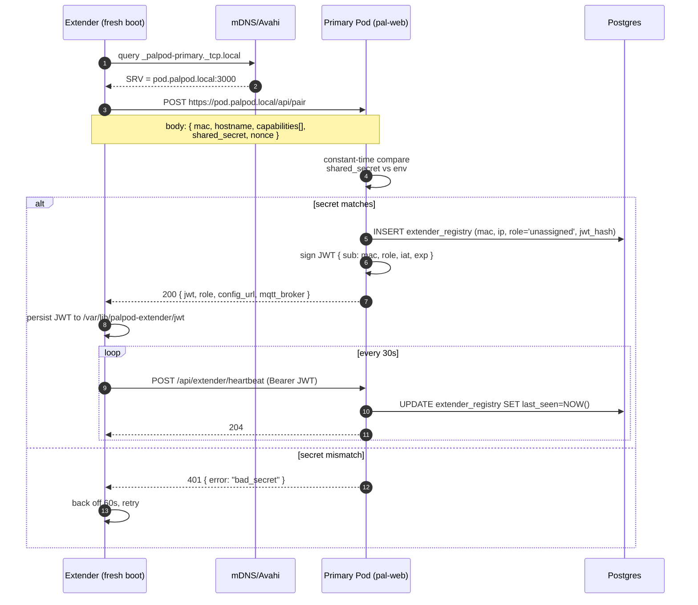

# Extender pairing protocol

An **extender** is any secondary compute node in the household — a Ryzen AI
box for game streaming, a spare Orin NX for media caching, a mic array on
its own SBC. Extenders discover the primary Pod via mDNS, present a shared
secret, and receive a JWT + role assignment they persist. From then on
every request they make to the primary is signed with that JWT.

This document specifies the protocol strictly enough that a firmware engineer
can implement the extender side from scratch in whatever language they like.

---

## 1. Sequence



---

## 2. Discovery — mDNS

The primary Pod publishes an Avahi service with type `_palpod-primary._tcp`
on port 3000. Publishing is done by `pal-web` at boot via the `avahi` Node
bindings; the record looks like:

```
Name:  Hearth primary
Type:  _palpod-primary._tcp
Port:  3000
TXT:
  proto=1
  api=/api/pair
  domain=palpod.local
```

Extenders MUST query `_palpod-primary._tcp.local` and use the SRV target,
not a hard-coded hostname. If multiple primaries respond (misconfiguration —
there should only ever be one) the extender MUST refuse to pair and log a
loud error.

---

## 3. Pair request

`POST /api/pair` on the primary's `pod.palpod.local:3000`.
No auth header — the request body carries the shared secret.

Request:

```json
{
    "mac": "aa:bb:cc:11:22:33",
    "hostname": "pod-mic-01",
    "capabilities": ["mic-array-6ch", "aec", "audio-out"],
    "shared_secret": "<value of PAL_EXTENDER_SHARED_SECRET>",
    "nonce": "b1e6…"
}
```

Rules:

- `mac`: canonical lower-case colon form. The primary uses this as the
  extender's persistent identity.
- `hostname`: informational; may be overridden by pal-web later.
- `capabilities`: opaque string tags. Pal-web uses these to suggest a role.
- `shared_secret`: compared in constant time against
  `PAL_EXTENDER_SHARED_SECRET` from the primary's `.env`.
- `nonce`: 128-bit random. Primary rejects any nonce it has seen in the last
  hour to make replay attacks pointless.

Response (200):

```json
{
    "jwt": "eyJhbGciOi…",
    "role": "unassigned",
    "config_url": "https://pod.palpod.local/api/extender/<mac>/config",
    "mqtt_broker": "mqtts://pod.palpod.local:8883"
}
```

Errors:

| Code | Body                              | Meaning                                  |
|------|-----------------------------------|------------------------------------------|
| 400  | `{ "error": "bad_request" }`      | Missing/invalid field                    |
| 401  | `{ "error": "bad_secret" }`       | Shared secret mismatch                   |
| 409  | `{ "error": "already_paired" }`   | This MAC is already registered; re-pair via `DELETE /api/extender/<mac>` on the primary first |
| 429  | `{ "error": "rate_limited" }`     | More than 5 attempts in 60 s from this IP |

---

## 4. JWT contents

```json
{
    "iss": "palpod-primary",
    "sub": "aa:bb:cc:11:22:33",
    "role": "unassigned",
    "iat": 1_754_265_000,
    "exp": 1_785_801_000,
    "jti": "…random…"
}
```

- Signed with `PAL_WEB_JWT_SECRET` (HS256).
- 1-year expiry. Extender must renew via `POST /api/extender/renew` before
  expiry; response is a fresh JWT with the same `jti`.
- On role change (pal-web operator assigns the extender), the primary emits
  an MQTT message on `palpod/extender/<mac>/role` and the extender should
  request a new JWT to pick up the updated claim.

---

## 5. Role assignment (post-pair)

After pair, the extender's row in `extender_registry` has `role = 'unassigned'`.
An operator opens pal-web → **Extenders**, sees the new device, and picks a
role from the enum in [`configs/postgres/init.sql`](../configs/postgres/init.sql):

- `media-cache` — mirrors a subset of the media library, becomes a Plex/Jellyfin
  transcoding satellite.
- `game-node` — runs Sunshine + Steam, primary offloads streaming here.
- `mic-array` — publishes far-field mic PCM into pal-voice over MQTT.
- `display` — extra HDMI sink for pal-face (multi-room Sphere).
- `storage` — exposes NVMe as an iSCSI/NFS target.

Role change is pushed via MQTT; the extender persists it and reconfigures on
the fly. Extenders that don't understand a role MUST refuse it and log.

---

## 6. Manual pairing (debug)

If mDNS is broken (e.g. the extender is on a different VLAN and multicast
isn't crossing), pair by CLI on the primary:

```bash
sudo ./scripts/extender-pair.sh aa:bb:cc:11:22:33 10.0.5.42 mic-array
```

That inserts the row and prints a JWT you can `scp` to the extender's
`/var/lib/palpod-extender/jwt`.

---

## 7. Threat model reminders

- The shared secret is not a password on the extender's box — it lives in
  its firmware image. Rotate `PAL_EXTENDER_SHARED_SECRET` and re-flash if a
  unit is lost.
- The JWT is stored on the extender's disk. If the disk is stolen, revoke via
  `DELETE /api/extender/<mac>` on the primary — the corresponding row's
  `jwt_hash` disappears and subsequent requests 401.
- All primary↔extender traffic must be TLS (self-signed cert install same as
  the main clients). The extender pins the primary's cert on first pair.
