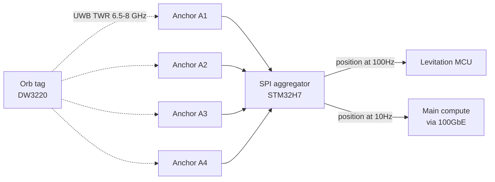

# UWB orb tracking

## Purpose

The orb is a physically levitating object whose position must be known to
~1 cm precision at 100 Hz for:

1. **Levitation servo loop** — Hall sensors are the primary sensor at close
   range (< 30 mm) but saturate outside their linear region. UWB is the
   coarse position sensor (30 – 200 mm range).
2. **Camera pointing** — the 6 orb cameras form a 360° ring; the main
   compute decides which pair to activate based on where users are relative
   to the orb.
3. **Phone hand-off** — user's phone (assumed iPhone with U1/U2 UWB or
   Pixel with Qorvo UWB) is located in 3D space to drive spatial UI:
   "point your phone at the pod to unlock" / "wave to pause".

## Anchor geometry (column-side)

4× Qorvo DW3220 anchors on the main column, mounted at:

- **A1**: top plinth, front-left corner
- **A2**: top plinth, front-right corner
- **A3**: top plinth, rear-left corner
- **A4**: top plinth, rear-right corner

The 4-anchor tetrahedron is only ~200 mm on a side (tight for UWB
trilateration), but the orb is always in the near-field within ~250 mm.
Expected 3D accuracy: **1 – 2 cm at 3σ**, sufficient for the servo coarse
loop and camera-pointing.

## Orb-side tag

1× Qorvo DW3220 in the orb, running as a **tag** (initiator). Two-way
ranging (TWR) with all 4 anchors, 100 Hz update rate.

## Data flow

## Phone hand-off

Modern iPhones (iPhone 11+) and Google Pixel (Pixel 6 Pro+) support UWB.
The main column can perform 1:1 ranging with the phone by:

1. Phone establishes BLE 5.4 with the pod (companion app).
2. BLE exchanges UWB session keys per FiRa PHY / IEEE 802.15.4z.
3. Column and phone run TWR; column computes phone azimuth + range.
4. Spatial UX: "the pod knows where I'm pointing my phone".

## Frequency plan

- Channel 5 (6.5 GHz) primary
- Channel 9 (8 GHz) fallback if 5 is congested
- Coordinate with Wi-Fi 6 GHz — UWB is below UNII-5 (5.925 GHz start), so no
  primary interference, but front-end filter selectivity matters.

## Antenna

Small monopole in the top plate center, dielectric window in the PVD steel.
Alternative: co-locate UWB antenna in the orb's polycarbonate hemisphere
so magnetic field doesn't detune.
