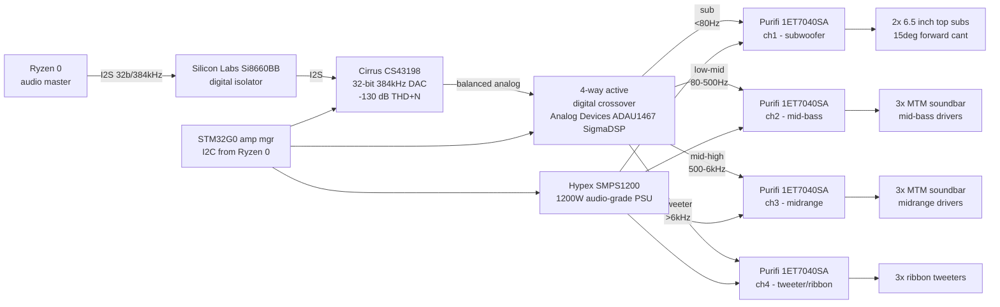

# Audio amp chain

## Signal path

## Key part numbers

| Function | Part | Digi-Key p/n |
|---|---|---|
| DAC | Cirrus Logic CS43198-CNZ | 598-2107-ND |
| Digital isolator | Silicon Labs Si8660BB-B-IS1 | 336-2447-ND |
| Crossover DSP | Analog Devices ADAU1467WBCPZ | 505-ADAU1467WBCPZ-ND |
| Power amp module | Purifi Audio 1ET7040SA | direct from Purifi (no distributor) |
| Amp PSU | Hypex SMPS1200A400 | direct from Hypex |
| Amp mgr MCU | STMicro STM32G071RBT6 | 497-STM32G071RBT6TR-ND |
| Ribbon tweeter | Aurum Cantus G3 (or equivalent) | audiophile channels |
| Midrange | Purifi PTT6.5W04-01A 6.5" | Purifi direct |
| Sub | Purifi PTT10.0W08-01A 10" (custom mount) | Purifi direct |

## Grounding and star point

- **Single-point ground** at the DAC's analog ground, tied to chassis via a 4 AWG braid.
- **Digital and analog domains separated by the Si8660 isolator.** Do not share the DAC's AGND with any digital signal.
- **Amp modules float** on their Hypex PSU and are transformer-isolated from the digital chain.

## Test criteria (pre-ship)

- THD+N ≤ 0.005% at 1 kHz, 1 W into 8 Ω (measured on Audio Precision APx555 or equivalent).
- SNR ≥ 118 dB A-weighted at 2.83 V RMS.
- Channel-to-channel gain match ± 0.1 dB.
- No audible turn-on/turn-off thump (mute relay controlled by STM32G0 amp manager).
