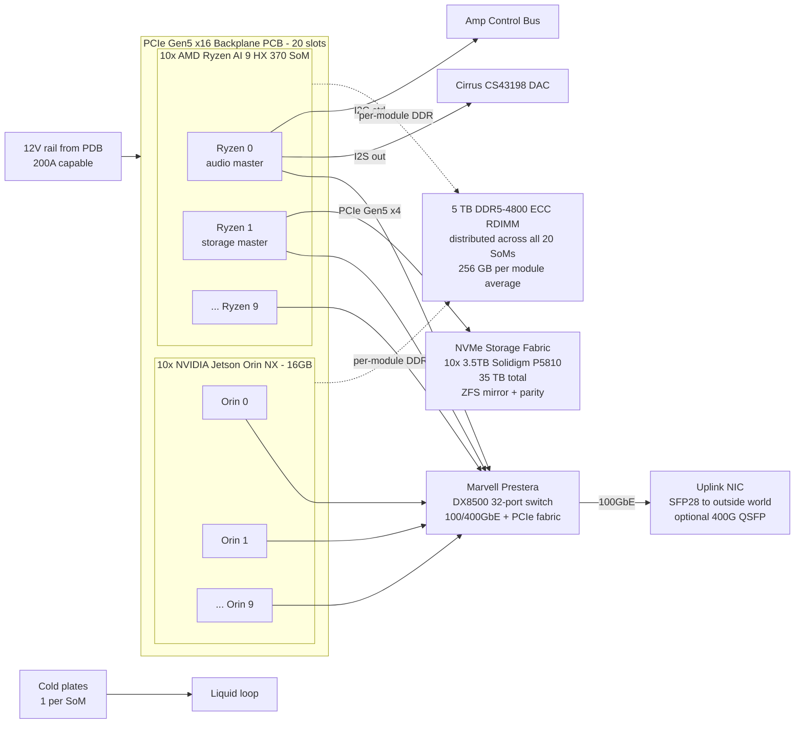

# Compute backplane — 10 Jetson + 10 Ryzen

## Topology

## Backplane PCB spec

- **Layer count**: 16 layers minimum. Recommended stackup:
  - L1 signal (top, fine pitch)
  - L2 GND
  - L3 signal (impedance-controlled, 85 Ω differential)
  - L4 GND
  - L5 signal (impedance-controlled)
  - L6 12V power plane
  - L7 3.3V power plane
  - L8 GND
  - (mirror L9–L16)
- **Material**: Megtron 6 (M6) or Isola I-Speed for PCIe Gen5 loss budget. Standard FR4 will not close timing at 32 GT/s.
- **Impedance**: 85 Ω ± 5% differential for PCIe; 50 Ω ± 5% single-ended for I2S/I2C.
- **Trace length matching**: intra-pair skew < 5 mil; inter-pair skew < 25 mil per byte lane.
- **Retimers**: expect to need PCIe Gen5 retimers (Astera Labs Aries) at ~10 inches of trace. Confirm with a sim in Ansys SIwave or Cadence Sigrity.

## Connector selection

- **Slot connector**: Amphenol ExaMEZZ or Molex NearStack 74441 for PCIe Gen5 x16. Do not use commodity DIMM slots or M.2 for high-speed lanes.
- **Power**: dedicated 12V blade contacts (30A per SoM slot) — Molex Mega-Fit or Amphenol RADSOK.
- **Latching**: mechanical latch that provides positive engagement feedback (audible click); the SoMs are field-replaceable.

## Firmware boot flow (informational)

Ryzen 0 boots first (BIOS in a dedicated SPI flash), configures the switch,
then powers on the remaining SoMs in a staggered sequence via I2C (SMBus)
control lines to the PDB. Total cold-boot time budget: 25 s (audience-facing;
UX requirement).

## Failure modes / redundancy

- Any single SoM can fail; workloads redistribute via the OS layer.
- PSU is 1+1 hot-standby; loss of one PSU derates compute to 60% but stays up.
- NVMe fabric is ZFS RAID-Z2; two-drive failure tolerated.
