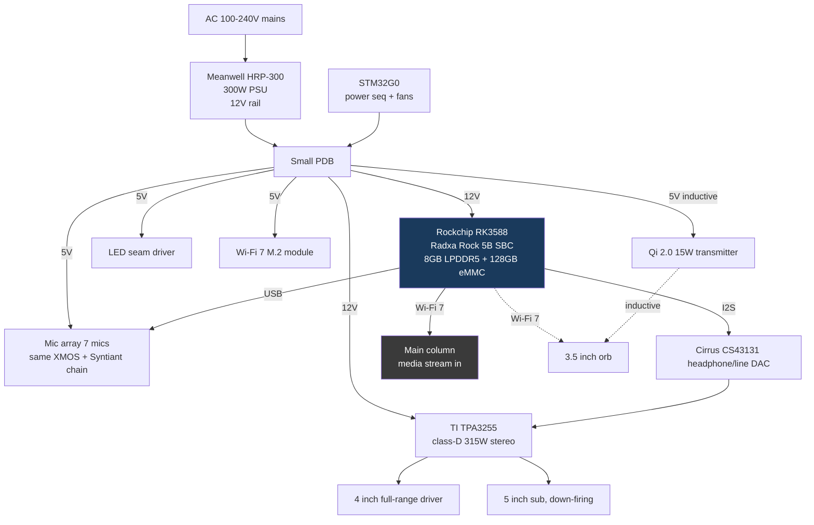

# Extender — half-scale thin client

## Block diagram

## Key differences vs main

| Subsystem | Main | Extender |
|---|---|---|
| Compute | 10 Jetson + 10 Ryzen | 1 RK3588 SBC |
| DAC | Cirrus CS43198 | Cirrus CS43131 |
| Amp | Purifi 1ET7040SA (4 ch) | TI TPA3255 (2 ch) |
| Drivers | 3 soundbar arrays + 2 subs | 1 full-range + 1 sub |
| Mic array | 13 mics dual ring | 7 mics single ring |
| Orb | 7" 1440p | 3.5" 720p |
| Halbach | Yes | No — orb sits in a magnetic cradle without active levitation |
| PSU | 2x 1500W redundant | 1x 300W |
| Wireless | Wi-Fi 7 + BT 5.4 + Thread + UWB | Wi-Fi 7 + BT 5.4 |
| Cooling | Liquid + fans | Passive + 1 slow fan |

## Data flow with the main column

Extender is a **stateless thin client**. All media/AI computation runs on the
main. The extender receives:
- Encoded audio + video (HEVC / VVC) over Wi-Fi 7
- Beamformed mic uplink (Opus, 32 kbps)
- Presence/config metadata (JSON over WebSocket)

If the main column is offline, the extender falls back to a local wake-word
+ radio-playback mode using the RK3588 alone.
