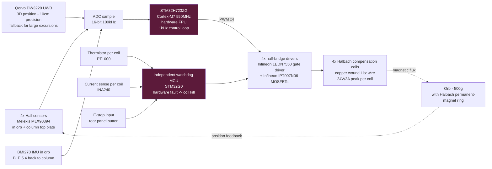

# Halbach levitation controller

Safety-critical closed-loop servo. Loses control → the orb falls, breaks a
$3k display and possibly a user's foot. Treat this subsystem to automotive
functional-safety practices (ISO 26262 ASIL-B equivalent) even though there
is no formal automotive requirement.

## Servo loop

## Loop rate & latency budget

- Sensor sample rate: 1 kHz (Hall) / 10 Hz (UWB assist) / 200 Hz (IMU over BLE)
- Control loop: 1 kHz PID + Kalman filter fusing all three sensors
- Actuator update: 20 kHz PWM per coil
- End-to-end sense→actuate latency: < 2 ms

## Safety interlocks

1. **Thermal cutout** — any coil > 80 °C → all coils killed via watchdog.
2. **Overcurrent** — any coil > 2.5 A for > 10 ms → all coils killed.
3. **Position out-of-envelope** — orb > 20 mm off center for > 200 ms → soft-land routine (raise field, decrement gently, catch on cradle rim).
4. **BLE link loss** — orb IMU data stale > 500 ms → soft-land routine.
5. **User E-stop** — physical button on rear panel; hardware line to watchdog, coils killed within 10 ms.
6. **Power fail** — bulk cap on driver rail sized for 200 ms soft-land energy.

## Fault-tolerance summary

| Fault | Response | Time-to-safe |
|---|---|---|
| Single coil driver short | Isolate via fuse, degrade to 3-coil control | < 5 ms |
| MCU firmware hang | Watchdog reset + coil-kill | < 100 ms |
| Complete power loss | Bulk-cap-powered soft land | 200 ms |
| Sensor disagreement > threshold | UWB arbitrates; soft-land if all disagree | 500 ms |

## Regulatory note

The Halbach coils radiate low-frequency magnetic fields. Verify per ICNIRP
2020 general-public reference levels (5 mT for 1 Hz – 8 Hz, decreasing to
0.2 mT at 800 Hz). At the exterior surface of the column the field should
be < 100 µT. Test with a Narda ELT-400 field meter during EMC compliance.

Include the ISO 7010 W006 magnetic-field warning label near the top plate
and a pacemaker warning in the setup manual.
