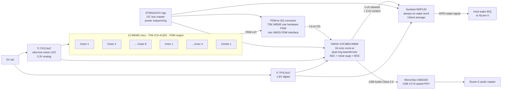

# Far-field mic array

## Block diagram

## Layout notes

- 13 mics form **two concentric rings + center**:
  - **Outer ring**: 8 mics at R = 60 mm, 45° spacing
  - **Inner ring**: 4 mics at R = 30 mm, 90° spacing, rotated 45° from outer
  - **Center**: 1 mic at origin
- Chosen because it gives XMOS's dual-ring beamformer maximum spatial diversity across the frequency band (small ring for high-freq, large ring for low-freq).

## Clocking

- Single 24.576 MHz TCXO (Abracon ASTX-H11) feeds XMOS.
- XMOS generates PDM clock for all 13 mics via a fanout buffer (Diodes Inc PI6C557-05).
- Trace-length match all 13 PDM_CLK traces to < 5 mm skew.

See `../mic-array-reference-design.md` for the full BOM and PCB stackup.
