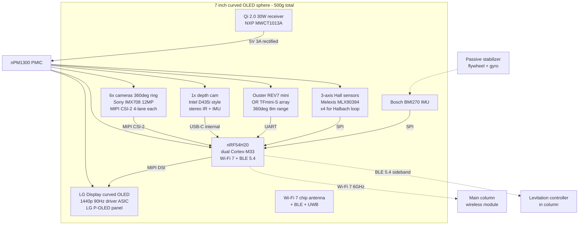

# Orb — 7" curved OLED sphere

## Block diagram

## Power budget (orb)

| Load | Peak (W) | Nominal (W) |
|---|---|---|
| OLED panel + driver | 12 | 5 |
| 6x IMX708 cameras (streaming) | 6 | 2 (only 2 active at a time) |
| Depth cam | 3 | 3 |
| LIDAR | 2 | 1 |
| MCU + radios | 3 | 1.5 |
| Hall sensors + IMU | 0.2 | 0.2 |
| **Total** | **~26** | **~13** |

Inductive charger sized for 30 W peak. Do not exceed 30 W continuous — the
receiver coil temperature rises fast at 5A and the orb has no fan.

## Wireless link budget

- Wi-Fi 7 320 MHz channel in 6 GHz UNII-5, MCS 11 4K-QAM: ~4 Gbps raw.
- Payload: 4K@90 Hz encoded H.266/VVC ≤ 200 Mbps + 6-cam H.265 uplink ≤ 200 Mbps.
- Comfortable 20× margin; expect real-world reliability > 99.99% in a 3m radius from the column.
- BLE 5.4 LE Long Range mode for the safety-critical Halbach feedback loop (1 Mbps, 100 ms max latency budget).

## Mechanical constraints

- Total mass budget: 500 g (Halbach levitation limit at 12 mm air gap).
- Center of mass must be within 2 mm of geometric center or the levitation loop can't null the pendulum modes.
- Curved OLED is glass — the outer shell is a bonded polycarbonate hemisphere for impact.
