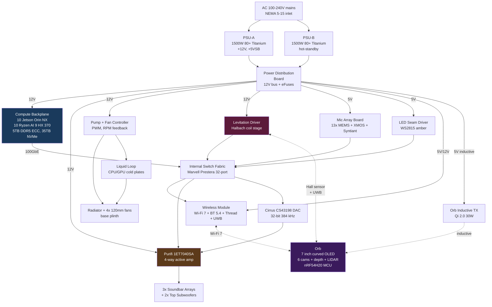

# System overview — MAIN column

Every top-level subsystem inside the main column and how it connects.
Extender is described separately in `extender.md`.

## Power domain summary

| Domain | Voltage | Peak current | Source |
|---|---|---|---|
| Compute rail | 12 V | 200 A (2400 W) | PDB from PSU |
| Audio amp rail | 12 V | 40 A (480 W) | PDB |
| Levitation coils | 24 V (boosted) | 8 A (192 W) | PDB via boost |
| Mic array | 5 V | 0.5 A (2.5 W) | PDB LDO |
| LED seams | 5 V | 3 A (15 W) | PDB |
| Wireless | 3.3 V + 5 V | 1 A | PDB LDO |
| Orb (inductive tx) | 12 V pri, 5 V sec | 2.5 A pri (30 W) | Qi 2.0 controller |

## Data topology

- **10 Jetson + 10 Ryzen** share a **PCIe Gen5 backplane** with cross-links via Marvell Prestera 32-port switch.
- **Audio** rides a dedicated **I2S bus** from the Ryzen designated as audio master to the CS43198 DAC (electrically isolated).
- **Mic array** returns beamformed audio as **USB 3.0** (UAC 2.0 class) to the audio-master Ryzen.
- **Orb link** is **Wi-Fi 7 6GHz** for A/V, plus a low-latency **BLE 5.4 sideband** for MCU control and Halbach servo feedback.
- **Wireless module** provides the outside-world links (Wi-Fi 7, BT 5.4, Thread 1.4, UWB).
