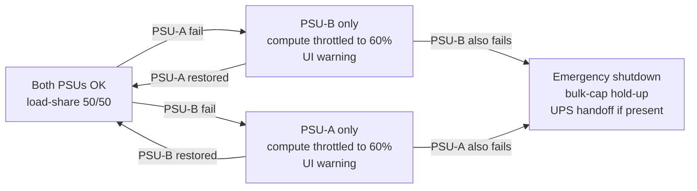

# Power tree

## AC-side

- Input: 100–240 V AC 50/60 Hz, single-phase
- Inlet: IEC C20 (16A) with integrated EMI filter (Schaffner FN9260)
- Fuse: 15 A slow-blow (both L and N)
- Ground: chassis to earth via inlet ground pin (safety class I)

## Primary DC generation

Two **1500 W 80 PLUS Titanium** server-grade PSUs, 1+1 hot-standby, ORing on the output side.

- Candidates: FSP FSP1500-50AGB, Delta DPS-1500EB, Great Wall GW-EPS1500DA
- Output: **12 V main rail** (125 A per PSU nominal), 5 V standby (5 A)
- Efficiency at 50% load: ≥ 96%
- MTBF: ≥ 200,000 h (per Bellcore TR-332 at 25 °C)
- ORing: TI TPS2412 or discrete P-MOSFET + comparator; auto-failover < 100 µs

**Total available**: 3000 W peak (single-PSU failure derates to 1500 W → software throttles compute).

## 12V distribution and per-subsystem loads

| Rail / Consumer | Peak (W) | Nominal (W) | Notes |
|---|---:|---:|---|
| Compute backplane (10 Jetson + 10 Ryzen) | 2400 | 900 | Jetson 25W × 10 + Ryzen 45W × 10 nominal; 4× that at burst |
| NVMe storage (10 × 3.5TB) | 100 | 50 | Solidigm P5810 ~7W/drive R/W |
| Internal 100GbE switch (Marvell Prestera) | 80 | 60 | — |
| Purifi 4-way amp | 480 | 60 | Class D, high dynamic range |
| Levitation coil driver | 192 | 40 | Halbach 4 coils, 24V boosted |
| Pump + fans (liquid loop) | 60 | 30 | D5 pump + 4× 120mm PWM fans |
| Wireless module (Wi-Fi 7 + BT + Thread + UWB) | 12 | 6 | — |
| Orb inductive TX (Qi 2.0 30W) | 40 | 15 | 75% eff, orb draws 30W peak |
| Mic array board | 2.5 | 1.5 | 5V, LDO'd |
| LED seams (WS2815 amber) | 15 | 3 | Full brightness rarely reached |
| Cirrus DAC + ancillary audio digital | 3 | 2 | — |
| Housekeeping MCUs (STM32, PDB, PSU mgr) | 5 | 3 | — |
| **Total (peak)** | **3390** | **1170** | Peak > single-PSU; both PSUs required for peak |

## Rail generation (from 12V)

| Rail | V | Load (A) | Source | Vendor part |
|---|---|---:|---|---|
| 5V system | 5 | 10 | Sync buck | Vicor DCM3623 or TI TPS543C20 |
| 3.3V system | 3.3 | 6 | Sync buck | TI TPS543C20 |
| 24V boost (levitation coils) | 24 | 8 | Sync boost | LT8390 |
| Per-SoM point-of-load | 0.8–1.2 | 30 each | On-SoM VRM | (on SoM) |
| Analog rails (audio) | ±15 | 0.5 | Isolated flyback + LDO | TI LM5155 + LT3080 |
| 5V standby | 5 | 1 | From PSU 5VSB | — |

## eFuse and protection

- Per major load: TI TPS26630 or Infineon PROFET+2 eFuse, programmable current limit + telemetry.
- Compute backplane: 250 A shunt + INA226 current monitor per slot (SMBus telemetry to Ryzen 0).
- Levitation rail: dedicated eFuse with 2.5 A hard limit + independent watchdog kill.

## Inrush and hold-up

- 10× 10,000 µF 25V bulk caps at PDB input (100,000 µF total) provides ~500 ms hold-up at 500 W → enough for graceful shutdown on brown-out.
- NTC inrush limiter (Ametherm SL22 5R010) in series with each PSU input for cold-plug inrush.

## EMI / EMC recommendations

1. **Common-mode chokes** on every off-board harness leaving the enclosure (Würth 74271 series).
2. **Ferrite bead** on every DC supply feeding an RF-sensitive circuit (mic array, wireless).
3. **Star grounding** at PDB; single point where all chassis returns join.
4. **Cable shielding**: shielded twisted pair for every I2S line > 100 mm. Shield tied at DAC side only.
5. **Pre-scan** at 30 MHz – 6 GHz (radiated) and 150 kHz – 30 MHz (conducted) at a 3-meter chamber before submitting to certification lab (see `docs/CERTIFICATION-PLAN.md`).

## PSU redundancy state machine (informational)

