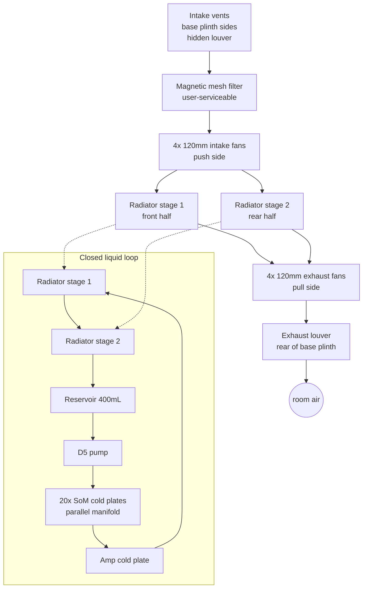

# Airflow diagram

## Airflow path (physical)

1. **Intake**: side louvers along the lower base plinth, on both L and R sides. Hidden behind an angled brushed-steel grille so it's not visible at eye level. Total intake area ~120 cm² per side (240 cm² total).
2. **Filter**: magnetic mesh (~40 PPI) — user-serviceable, snaps off for cleaning.
3. **Fan bank**: 4× intake fans + 4× exhaust fans on the radiator stack (push-pull).
4. **Radiator**: 480×30mm slim × 2 stages.
5. **Exhaust**: rear louver, angled downward to sweep exhaust away from user seating.

## Compute bay airflow (secondary)

The compute bay is **cooled by liquid, not air**. No fans in the compute stack itself. Convection is passive — the walnut panels are lined with 10 mm melamine acoustic foam that doubles as thermal isolation, keeping the outer walnut surface below 40 °C.

Two small 40 mm axial fans behind the compute backplane serve *only* to sweep the interior air across the DDR5 DIMMs (which have thermal pads to the chassis but no direct liquid contact). These run at 200 RPM baseline and are barely audible.

## Acoustic target

- Total acoustic output at nominal load: < 24 dBA @ 1 m (below room noise floor in a typical living room).
- Peak: < 40 dBA @ 1 m (still quieter than a modern refrigerator).
- Measured per ISO 3745 in a hemi-anechoic chamber during EMC/acoustic validation.
